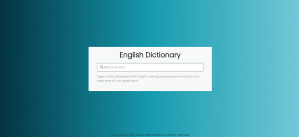

# random-dictionary-generator
This is a simple Random Dictionary Generator built using HTML, Bootstrap 5, JavaScript.

# Demo Project

### https://jasserba.github.io/random-dictionary-generator/

#### Click to see full GIF

This is a simple README file to provide an overview of the Dictionary App Generator project. The project creates a web-based English dictionary application using HTML, JavaScript, and Bootstrap 5. The application allows users to search for word meanings, examples, pronunciations, and synonyms.

Project Description
-------------------

The Dictionary App Generator is a web application that lets users search for the meaning, example sentences, pronunciation, and synonyms of English words. It utilizes the [dictionaryapi.dev](https://dictionaryapi.dev/) API to fetch word definitions and related information.

Features
--------

-   Search for the meaning of English words.
-   Display example sentences for the searched word.
-   Provide phonetic pronunciation of the word.
-   Show synonyms of the searched word.
-   Responsive design using Bootstrap 5.

Getting Started
---------------

To run the Dictionary App Generator on your local machine, follow these steps:

1.  Clone the repository:

bashCopy code

`git clone https://github.com/your-username/dictionary-app-generator.git`

1.  Navigate to the project directory:

bashCopy code

`cd dictionary-app-generator`

1.  Open the `index.html` file in your web browser.

Usage
-----

1.  Enter a word in the search input field and press Enter.
2.  The app will display the meaning, example sentences, phonetic pronunciation, and synonyms of the searched word (if available).
3.  Click the speaker icon to listen to the pronunciation of the word.
4.  Click on a synonym to search for its meaning.

Technologies Used
-----------------

-   HTML: The structure of the web page.
-   JavaScript: Interactivity and fetching data from the API.
-   Bootstrap 5: Styling and layout.
-   [dictionaryapi.dev](https://dictionaryapi.dev/): API for fetching word definitions.

Code Explanation
----------------

The `index.html` file contains the structure of the web page, including input fields and result sections. The `index.js` file handles the interactivity, API calls, and data rendering.

Contributions
-------------

Contributions to this project are welcome! If you find any issues or have suggestions for improvements, please create an issue or submit a pull request.

License
-------

This project is licensed under the MIT License. See the [LICENSE](https://chat.openai.com/c/LICENSE) file for details.

Author
------

This Dictionary App Generator was developed by [Your Name](https://github.com/your-username).

* * * * *

Feel free to customize this README to fit your project's details and make any necessary changes. Good luck with your Dictionary App Generator project!